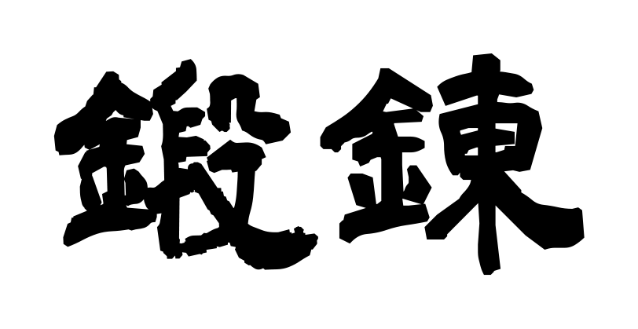

<h1>Tanren</h1>

  <b>Allenamento del giapponese: kana, kanji, grammatica.</b>

  
  
  
  
  

  
  

 

## 鍛 Il nome

I due ideogrammi <b>鍛錬</b> che compongono questa parola rappresentano il concetto di 
lavoro costante necessario per raffinare e consolidare un metallo per la sua forgiatura.

Nell'ambito dell'apprendimento di una disciplina fisica, <i>tanren</i> non è riferito tanto 
allo sviluppo di un'abilità tecnica specifica, ma piuttosto alla necessaria 
preparazione di base preliminare.

 

## 錬 Il progetto

<b>Tanren</b> è un'app open-source per l'allenamento del giapponese: hiragana, 
katakana, kanji e, in una fase successiva, grammatica.

Ogni argomento si allena in due modi complementari.

<table>
<tr>
<td align="center" width="50%">

### 認識
**Riconoscimento**

Esercizi di matching a scelta multipla, per costruire la lettura immediata.

</td>
<td align="center" width="50%">

### 入力
**Input diretto**

Digitazione della risposta con l'IME giapponese reale del dispositivo.

</td>
</tr>
</table>

 

## 稽古 Come funziona

<table>
<tr>
<td align="center" width="33%">

**Local-first**

Nessun account, nessun server. I dati restano sul dispositivo.

</td>
<td align="center" width="33%">

**Ripetizione spaziata**

Un algoritmo SRS decide cosa ripassare, poco prima che venga dimenticato.

</td>
<td align="center" width="33%">

**Mobile-first**

Pensata per lo schermo piccolo e l'uso con il pollice. Anche su desktop.

</td>
</tr>
</table>

 

🚧 Progetto in fase iniziale di sviluppo.

