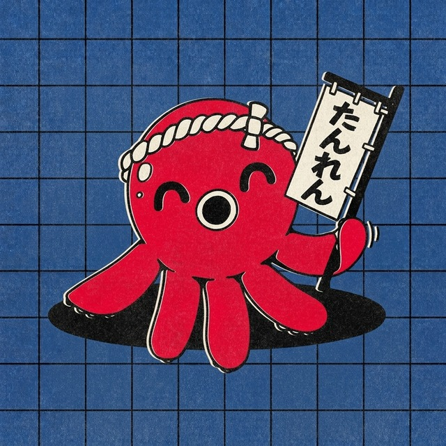

<div align="center">



<h1>Tanren</h1>

<p>
  <b>Japanese training: kana, kanji, grammar.</b>
</p>

<p>
  
  
  
  
  
</p>

<p>
  
  
</p>

</div>

<br>

<div align="center">

## 鍛 The name

The two characters <b>鍛錬</b> that form this word carry the idea of the steady work<br>
it takes to refine and consolidate a metal before it can be forged.

In the learning of a physical discipline, <i>tanren</i> does not refer to developing<br>
one specific technique, but rather to the groundwork that has to come first.

<br>

## 錬 The project

<b>Tanren</b> is an open-source Japanese training app: hiragana, katakana,<br>
kanji and, in a later phase, grammar.

Every subject is trained in two complementary ways.

<table>
<tr>
<td align="center" width="50%">

### 認識
**Recognition**

Multiple choice matching, to build immediate reading.

</td>
<td align="center" width="50%">

### 入力
**Direct input**

Typing the answer with the device's real Japanese IME.

</td>
</tr>
</table>

<br>

## 稽古 How it works

<table>
<tr>
<td align="center" width="33%">

**Local-first**

No account, no server. Your data stays on the device.

</td>
<td align="center" width="33%">

**Spaced repetition**

An SRS algorithm decides what to review, just before you would forget it.

</td>
<td align="center" width="33%">

**Mobile-first**

Built for a small screen and thumb reach. Desktop works too.

</td>
</tr>
</table>

</div>

<br>

<div align="center">

## 導入 Install

<a href="https://github.com/Omisen/tanren/releases/latest">
  
</a>

</div>

Grab the APK from the [latest release](https://github.com/Omisen/tanren/releases/latest)
and open it on the phone. The build carries `arm64-v8a` and `armeabi-v7a`.

**Play Protect refuses the install the first time.** It says it has never seen an app from
this developer, which is true: it happens to any app signed with a key Google does not
know. Tap **More details**, then **Install anyway**. The warning will not go away while
Tanren is distributed outside the stores.

`minSdk` is 24, so Android 7 and up in principle, but it has only been run on **Android
15**. Below Android 11 the on-screen keyboard may cover the question you are answering,
because older versions do not report keyboard insets reliably.

**There is no desktop download, and that is deliberate.** Android is the only surface you
cannot use without an executable, so the release carries an APK and nothing else. On a
desktop you clone and run, which takes two commands and is described below. Building and
hosting three binaries for three operating systems would be three build chains to maintain
for the secondary case.

<br>

<div align="center">

## 開発 Development

</div>

### Prerequisites

- **Node** 20.19+ or 22.12+, as required by Vite 8.
- **Rust** stable 1.85+, required by edition 2024.
- On Linux, Tauri's system libraries. On Ubuntu 24.04:

```bash
sudo apt install -y libwebkit2gtk-4.1-dev build-essential curl wget file \
  libxdo-dev libssl-dev libdbus-1-dev pkg-config
```

On macOS you need the Xcode command line tools, on Windows the Visual Studio Build
Tools with the C++ workload, plus WebView2.

### Running the app

```bash
npm install
npm run tauri dev
```

The first run compiles the whole Rust dependency tree and takes a few minutes. Later
runs are immediate. The window opens in portrait shape, because the design targets the
phone first.

### Useful commands

| Command | What it does |
|---|---|
| `npm run tauri dev` | the full app, Tauri shell plus frontend |
| `npm run dev` | frontend only in the browser, without the Rust core |
| `npm run build` | production build of the frontend |
| `npm run lint` | oxlint, including the cross feature import rules |
| `npm run tauri build -- --no-bundle` | desktop executable, without the packaging step |
| `cargo check --workspace` | compile everything on the Rust side |
| `cargo test -p tanren-core` | domain tests, without starting Tauri |

<details>
<summary>The app builds but crashes on startup on Linux</summary>

<br>

If the error looks like this:

```
symbol lookup error: /snap/core20/.../libpthread.so.0:
undefined symbol: __libc_pthread_init, version GLIBC_PRIVATE
```

your terminal is inheriting the environment of an editor installed as a **snap**.
`GTK_PATH` points at the snap's GTK modules, GTK loads `canberra-gtk-module` from
there, and that module drags in the glibc under `/snap/core20`. The same thing
happens to WebKit's network process through `GIO_MODULE_DIR`.

The snap keeps the original values in `*_VSCODE_SNAP_ORIG` variables, so the clean
fix is to restore them. This works in both bash and zsh, and is safe to keep in your
shell startup file:

```bash
while IFS='=' read -r var val; do
  name="${var%_VSCODE_SNAP_ORIG}"
  if [ -n "$val" ]; then export "$name=$val"; else unset "$name"; fi
done < <(env | grep '_VSCODE_SNAP_ORIG=')
```

For a single run, clearing the two variables at fault is enough:

```bash
env -u GTK_PATH -u GIO_MODULE_DIR npm run tauri dev
```

From a regular system terminal the problem does not occur.

</details>

<br>

<div align="center">

## License

**[MIT](LICENSE)** &nbsp;&middot;&nbsp; Copyright &copy; 2026 Omisen

<sub>
Tanren bundles <b>M PLUS Rounded 1c</b>, subset to the characters the app displays.<br>
The font stays under the <b>SIL Open Font License 1.1</b>, whose text ships alongside it
in <code>public/fonts/OFL.txt</code>.
</sub>

<br><br>

<sub>🚧 Early stage project, under active development.</sub>

</div>
